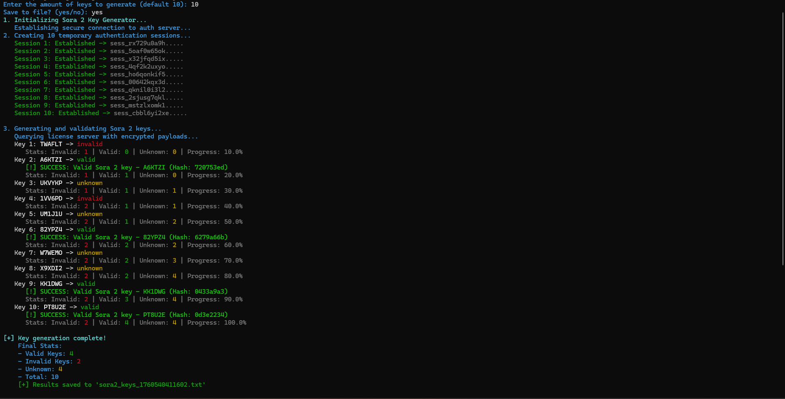

# Sora2 Key Generator

A Node.js script to simulate generating and validating authentication keys for a hypothetical Sora2 service.  
It features a simple CLI, colorful output, retry logic, and optional file saving.

---

## 🧩 Features

- Generates a 6-character keys  
- Simulates API calls for session creation and key validation  
- Saves results to a timestamped `.txt` file (optional)

---




## ⚙️ Prerequisites

- **Node.js**: v18 or higher  

---

## 🧰 Installation

1. **Clone the Repository**

   ```bash
   git clone https://github.com/sinrazed/sora-2-key-generator.git
   cd sora2-key-generator
> Replace the URL above with your actual repository link.

---

## Installation

```bash
npm install
```

Run the Script
```bash
node index.js
```

Answer the Prompts

```bash
Enter the amount of keys to generate (default 10): 5
Save to file? (yes/no): yes
```

> example console output

```bash
Sora 2 Key Generator Results
==============================

ABC123: valid (Hash: 4a3b2c1d)
XYZ789: invalid (Hash: 7e6f5d4c)

Summary: Valid=2 | Invalid=2 | Unknown=1
```

📄 License

Licensed under the MIT License.
See the LICENSE file for details.

